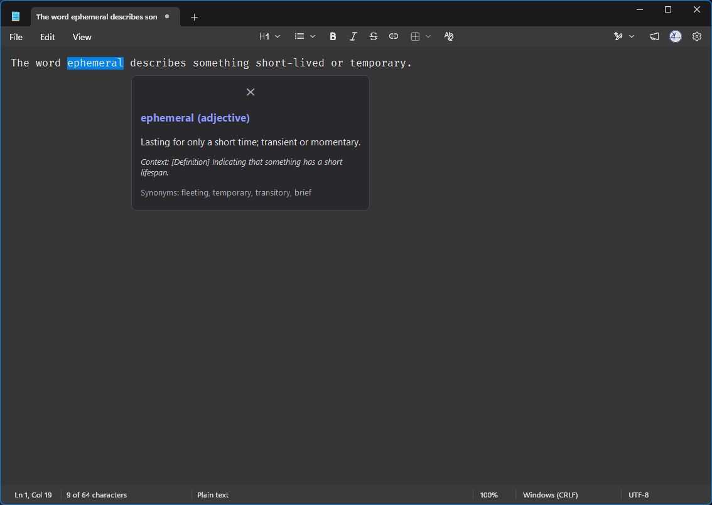

# Contextual Intelligence

Windows-native, local-first contextual lookup: select a word anywhere in
Windows, trigger a hotkey, and get a compact dictionary card explaining the
word *as used in that context* — answered by a local model via LM Studio.
Smart Paste is a preview-first clipboard transformer for paragraph-level
rewriting and transformation.

## Who this is for

Contextual Intelligence is for Windows users who want local-first text assistance
without sending selected text or clipboard content to a hosted cloud assistant.
It is aimed at people who already use, or are willing to run, LM Studio locally:
writers, developers, researchers, and operators who often need quick contextual
explanations or text transformations from the app they are already working in.

This is not a polished packaged consumer app yet, not a hosted service, and not
a tool for extracting secrets or password fields. Secure or unsupported fields
should fail safely instead of being forced through capture.

## 30-second mental model

```text
select text → hotkey → capture → validate → local model → popup / preview
```

- **Contextual Lookup:** selected text and surrounding context become a compact explanation popup.
- **Smart Paste:** clipboard text plus an instruction becomes a preview-first transformed result before copy/paste.

## What it does

- Explains selected words or short phrases in the context where they appear.
- Transforms copied text through a preview-first Smart Paste palette.
- Keeps clipboard mutation explicit: transformed text is copied only when the user clicks Copy.
- Uses local model serving by default through LM Studio's OpenAI-compatible API.
- Treats unsupported or failed paths as product states that need clear user guidance, not raw internal errors.

## What it does not do

- It does not run under WSL; the app depends on Windows hotkeys, clipboard, UI Automation, and Qt UI behavior.
- It does not automatically paste transformed text back into the source application.
- It does not include a cloud fallback by default.
- It is not a general screen reader or OCR tool.

## Current maturity

This is a Windows-only, run-from-source developer preview. Contextual Lookup
and Smart Paste are implemented and covered by automated/manual regression
tests, but packaging, installer support, speech input, and broader
app-compatibility polish are still planned.

- **Project knowledge:** longer design notes are maintained in a local LLM Wiki / knowledge base; this repository keeps the public-facing implementation docs.
- **Project rules:** [`PROJECT_RULES.md`](PROJECT_RULES.md) — canonical project-specific agent, QA, and graceful degradation rules. Tool-specific files such as `GEMINI.md`, `AGENTS.md`, or `CLAUDE.md`, if added, should point back there.
- **Manual QA:** [`docs/qa/manual-regression.md`](docs/qa/manual-regression.md) — repeatable smoke, coexistence, clipboard, placement, failure-state, and graceful degradation checks.
- **Task tracking:** work is managed in an issue tracker with acceptance criteria and QA evidence.
- **Status:** Phase 2 (Smart Paste MVP) & Phase 3 (Robustness & Graceful Degradation) Complete; Phase 4 (Speech Input / Voice-to-Transform) planned.

## Demo

<table border="0">
  <tr>
    <td width="50%" align="center" valign="top">
      <video src="https://github.com/user-attachments/assets/e396bf25-fde4-4e89-b26a-7bc751b769aa" width="100%" controls></video>
    </td>
    <td width="50%" align="center" valign="top">
      
    </td>
  </tr>
    <tr>
    <td align="center" valign="top">
      <p>Smart Paste transforms copied text through a preview-first palette.</p>
    </td>
    <td align="center" valign="top">
      <p>Contextual Lookup explains a selected term in place.</p>
    </td>
  </tr>
</table>

> GitHub's rendering of repository-local videos can vary. If the video does not
> render in the README, open [`docs/assets/smart-paste-demo.mp4`](docs/assets/smart-paste-demo.mp4)
> directly.

## Privacy and data handling

Contextual Intelligence is local-first by default.

- Selected text and clipboard text are processed locally by the app.
- Text is sent only to the configured OpenAI-compatible endpoint, typically LM Studio running on the same machine.
- No cloud fallback is enabled by default.
- Smart Paste reads clipboard text only when opened/triggered and does not mutate the clipboard until the user clicks Copy.
- Clipboard history is in-memory only and is not persisted to disk by this app.
- High-value non-text clipboard formats such as images, files, and audio are protected from destructive fallback handling.
- Logs are intended for capture tier, timing, and failure diagnostics, not content storage.

If you configure LM Studio or another OpenAI-compatible endpoint on another
machine, selected or copied text will be sent to that endpoint. Non-local
`http://` endpoints are rejected; use the default local HTTP endpoint or an
`https://` remote endpoint.

## Requirements

- Windows 11 (Win32 + UI Automation; will not run under WSL)
- [uv](https://docs.astral.sh/uv/) (Python 3.12 pinned via `.python-version`)
- LM Studio serving an OpenAI-compatible API on `localhost:1234`
  (default model: `google/gemma-4-e4b`)

Override the model, endpoint, token limits, or API key with
`%APPDATA%\contextual-intelligence\config.toml` or environment variables such
as `LMSTUDIO_BASE_URL`, `LMSTUDIO_API_KEY`, and `CI_MODEL`.

### First-run checklist

1. Confirm you are on Windows 11. This app depends on Win32 hotkeys, clipboard
   behavior, foreground-window handling, Qt windows, and UI Automation.
2. Install LM Studio and start its local server.
3. Load a local instruct model in LM Studio before running the app.
4. Clone the repository and install dependencies:

   ```powershell
   git clone https://github.com/kaizen-commits/contextual-intelligence.git
   cd contextual-intelligence
   uv sync
   ```

5. Run the smoke test:

   ```powershell
   uv run ci-lookup smoke
   ```

6. Try a non-GUI capture/lookup flow:

   ```powershell
   uv run ci-lookup capture --delay 3
   uv run ci-lookup lookup --delay 3
   ```

7. Launch the tray app:

   ```powershell
   uv run ci-lookup tray
   ```

8. Test against harmless sample text before using it in real work.

### Known-good local model starting points

Model names and quantizations vary in LM Studio, so treat these as starting
families rather than strict requirements.

| Model family | Expected rough behavior |
| --- | --- |
| Gemma 3/4-class 4B instruct model | Good first choice for short contextual definitions and simple paste transforms. Usually responsive once loaded; the first request may be slower while LM Studio warms the model. |
| Qwen 2.5/3-class 7B instruct model | Often stronger for instruction following and formatting transforms, with higher memory use and latency depending on hardware and quantization. |

If the smoke test fails, check that LM Studio is running, the model is loaded,
the endpoint is correct, and no environment override points at a non-local
`http://` endpoint. Remote endpoints must use HTTPS.

## Quick start

```powershell
git clone https://github.com/kaizen-commits/contextual-intelligence.git
cd contextual-intelligence
uv sync

uv run ci-lookup smoke
uv run ci-lookup capture --delay 3
uv run ci-lookup lookup --delay 3
uv run ci-lookup tray
```

`uv run ci-lookup tray` starts the tray app with global hotkeys. Use
`uv run ci-lookup listen` for a simpler terminal-only hotkey loop where
`Ctrl+Alt+D` triggers Lookup until `Ctrl+C` exits.

`--delay N` waits N seconds so you can click into another app and select a
word — the capture/lookup loop is testable without hotkey plumbing.

## Developer commands

```powershell
uv run ci-lookup smoke              # LM Studio round trip + loaded model list
uv run ci-lookup capture --delay 3  # select a word anywhere, see the captured payload
uv run ci-lookup lookup --delay 3   # full loop: capture -> validate -> streamed answer
uv run ci-lookup listen             # Ctrl+Alt+D triggers lookup until Ctrl+C
uv run ci-lookup tray               # tray app with Lookup and Smart Paste hotkeys
uv run pytest                       # automated regression suite
uv run ruff check .                 # lint
```

## LLM output expectations

Contextual Intelligence shows local model output; it does not guarantee that the answer or transformation is correct. Treat Lookup answers as quick context, not authoritative references, and review Smart Paste results before copying them into another app.

Local models may produce inaccurate, biased, incomplete, or unexpected text. Do not use model output as medical, legal, financial, safety-critical, or other professional advice without independent verification.

## Known limitations

- Windows only; WSL is not supported.
- UI Automation coverage varies by application.
- Protected/password fields are intentionally not captured.
- Some Electron, terminal, game-overlay, or heavily customized apps may expose limited text context.
- Smart Paste currently copies transformed text explicitly; it does not automatically paste back into the source app.
- Speech input, installer packaging, and OCR/image clipboard support are planned, not complete.

## Layout

```text
src/contextual_intelligence/
├── models.py                    ContextPayload, PastePayload, PasteResult — strict validation
├── clipboard.py                 Public text-only clipboard utility with retry backoff
├── capture/
│   ├── __init__.py              CaptureProvider protocol + tier orchestrator
│   ├── uia.py                   tier 1: UIA TextPattern (primary)
│   └── clipboard_fallback.py    tier 2: deterministic clipboard automation fallback
├── ui/
│   ├── tray.py                  QSystemTrayIcon + multi-hotkey background bridge
│   ├── popup.py                 Frameless near-cursor popup for Contextual Lookup
│   ├── palette.py               Frameless interactive palette for Smart Paste
│   ├── worker.py                LookupUIA capture & LLM streaming worker
│   ├── paste_worker.py          Smart Paste LLM streaming worker
│   └── positioning.py           Multi-monitor placement & DPI scaling fallback
├── llm.py                       LM Studio client + lookup/paste prompts & spelling inference
├── hotkey.py                    RegisterHotKey loop with multi-hotkey degradation
├── config.py                    settings + TOML override
├── log.py                       capture telemetry goes to stderr
└── cli.py                       smoke / capture / lookup / listen / tray
```

Design rules carried from the original app's failure: capture listeners have
an explicit arm → capture → disarm lifecycle with tests proving nothing stays
armed after a cycle; every capture is validated (empty/mojibake/oversized
rejected) before it reaches the model; every attempt logs tier, duration, and
failure reason so fallback work is driven by telemetry, not guesses.

## Security notes

See [`SECURITY.md`](SECURITY.md) for vulnerability reporting and endpoint trust notes.

## Third-party licensing

The project currently runs from source. If installers or binary bundles are
published later, include third-party license notices for runtime dependencies,
especially PySide6 / Qt. PySide6 is available under LGPL/GPL terms; binary
packaging must preserve the applicable Qt notices and dynamic-linking/compliance
requirements.

## Development credits

Contextual Intelligence is designed and maintained by Kaizen, with assistance from AI coding and reasoning tools:

- Hermes / GPT-5.5 — project orchestration, architecture review, QA planning, documentation, and implementation support
- Claude Fable 5 — implementation and code review assistance
- ChatGPT — design exploration and product reasoning
- Gemini / Antigravity — implementation planning, review, and alternative design suggestions

Final product decisions, testing, integration, and release responsibility remain with the human maintainer.

## License

MIT. See [`LICENSE`](LICENSE).
